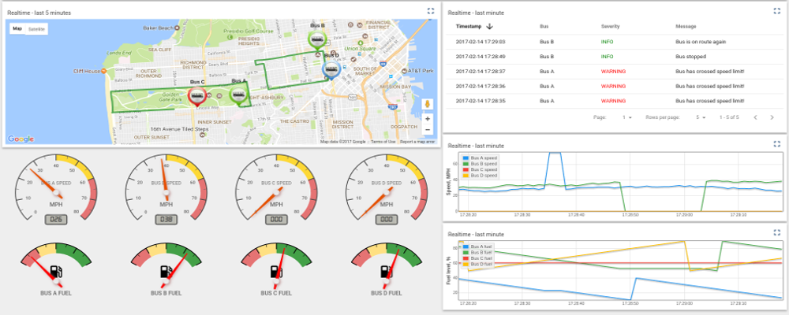

# IoT 平台简介

<https://thingsboard.io/>

IoT 平台用于数据收集，处理，可视化和设备管理的平台。

通过行业标准的IoT协议（MQTT，CoAP和HTTP）实现设备连接，并支持云和本地部署。 结合了可扩展性，容错性和性能，因此您永远不会丢失数据。

# 实时物联网仪表板

允许您实时创建丰富的IoT仪表板，实现数据可视化和远程设备控制。 内置超过30个可定制的组件，允许您为大多数物联网用例构建最终用户自定义仪表板。

- 提供和管理设备

使用丰富的服务器端API，以安全的方式提供，监控和控制设备。

- 收集和可视化数据

以可扩展和容错的方式收集和存储遥测数据。 通过内置或自定义小部件和灵活的仪表板可视化数据。 与客户共享仪表板。

- 处理和响应

使用插件定义数据处理规则并触发反应。 根据传入的遥测事件或属性更新的发起警报。

- IoT网关

使用现有协议，集成连接到旧版和第三方系统的设备。 参照我们的最佳实践，几分钟内连接到您的OPC-UA服务器或MQTT代理。

# 功能特点

- 遥测数据采集

可靠的方式收集和存储遥测数据，不受网络和硬件故障影响。使用可定制的Web仪表板或服务器端API访问收集的数据。

- 水平可扩展性

可支持的服务器端请求和设备的能力随着新的IoT服务器添线性增加。以群集模式，无停机，服务器重新启动或应用程序错误。

- 数据可视化

提供30多个可配置部件，并使用内置编辑器创建自己的组件。内置线形图，数字和模拟仪表板，地图等。

- 容错

所有服务器是同等的。没有主或热备用之分。节点故障自动检测。失败的节点可以不停机更换。使用可靠的NoSQL数据库复制持久数据。

- IoT规则引擎

基于设备属性或消息内容，使用灵活的规则和插件处理传入的设备数据。使用规则转发到外部系统或触发报警。使用插件提供丰富服务器端功能或向设备发送指令。

- 安全

支持MQTT和HTTP协议的传输加密。支持设备认证和设备凭据管理。

- 设备管理

提供注册和管理设备的能力。允许监视客户端和配置服务器端设备属性。为服务器端应用程序提供API，以RPC命令发送到设备，或反向亦然。

- 定制和集成

使用可定制的规则、插件、小部件和传输方式，实现默认平台功能扩展。除了MQTT，CoAP和HTTP支持之外，用户可以使用自己的传输实现或现有协议的自定义行为。

- 多租户

支持多租户安装开箱即用。单一租户可以有多个租户管理员和管理百万个设备和客户。
